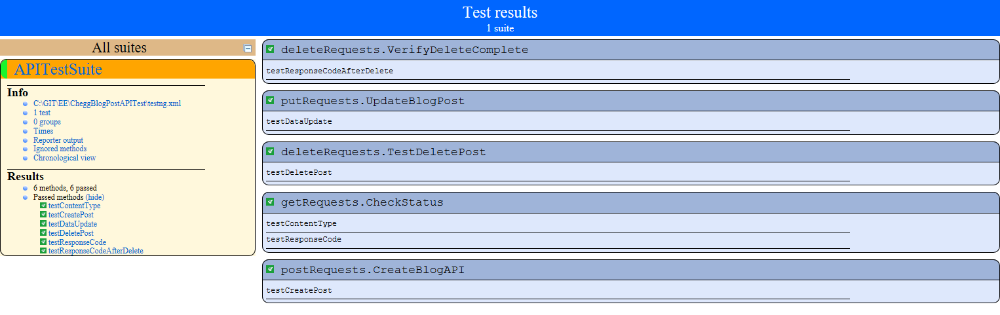

# CheggBlogPostAPITest
This project does automated API testing of JSON Blob API [https://jsonblob.com/api](https://jsonblob.com/api)

## QA Challenge Part 2

1. Create new blog post - *Please refer to :* **testCreatePost()**
2. Validate that blog post was created (verify status code is 200 & content-type is application/json) - *Please refer to :* **testResponseCode()** and **testContentType()**
3. Update the blog post - *Please refer to :* **testDataUpdate()**
4. Validate that blog post was updated - *Please refer to :* **testDataUpdate()**
5. Delete the blog post (verify status code is 200) - *Please refer to :* **testDeletePost()**
6. Verify that the blog post was deleted (verify status code is 404) - *Please refer to :* **testResponseCodeAfterDelete()**

### Test Report (with all 6 conditions PASSED):

### Steps to execute this project
Pre-Requisite: Java Environment
1. Clone the Project to local IDE (Eclipse preferred - due to step 2)
2. After cloning, install TestNG plugin for that IDE (go to https://testng.org/doc/download.html section titled "Eclipse Plug-In")
Note: TestNG has compatible plugin for Eclipse to execute locally. Not sure to what extent it is supported in other IDEs
3. Once TestNG is installed, open a file named "testng.xml" in the main project directory
4. In that file, right click->Run as->TestNG Suite
5. Tests will be launched and execution details will be seen in the console
6. Once the test has completed execution, head towards test-output folder (might need to refresh project if this folder is not seen at first) and open index.html to explore HTML version of test execution report.
